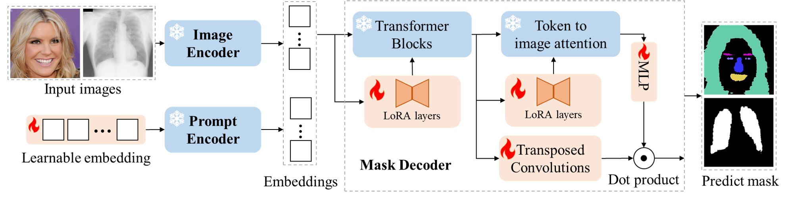

# BLO-SAM
This repository contains the implementation of the following paper:
> **BLO-SAM: Bi-level Optimization Based Finetuning of the Segment Anything Model for Overfitting-Preventing Semantic Segmentation**<br>

## Overview
  
Wwe introduce BLO-SAM, a bi-level optimization (BLO) method addressing the need for finetuning model parameters and prompt embedding on two subsets of the training data to reduce overfitting. Illustrated in the above figure, BLO-SAM involves two sets of learnable parameters: LoRA layers and unfrozen model components, and the prompt embedding. These components undergo optimization through two levels of nested optimization problems.

## Prerequisites
- Linux (We tested our codes on Ubuntu 18.04)
- Anaconda

To get started, first please build the environment
```
conda env create -f blo-sam.yml
```

## Training
You can try our code on one of the public datasets we used in our experiments. Here are the instructions: 

1. Download the human [body segmentation datset](https://www.kaggle.com/datasets/tapakah68/segmentation-full-body-tiktok-dancing-dataset)
2. Split the original dataset into training and test sets. We use the last 2,000 samples as the test set in our experiments.
3. Change the data root setting in [train.sh](train.sh) as `<Your data path>`.
4. Run this commend to start the training process:
```bash
bash train.sh
```
If everything works, you can find the saved checkpoint in your save folder, which is also set in the train.sh file.

## Inference
You can test the trained model by simply run the command:
```bash
bash inference.sh
```
The root settings in [inference.sh](inference.sh) file are supposed to be changed to `<Your path>`.

## Citation
If you find this project useful in your research, please consider citing:
```bash
@article{zhang2024blo,
  title={BLO-SAM: Bi-level Optimization Based Overfitting-Preventing Finetuning of SAM},
  author={Zhang, Li and Liang, Youwei and Xie, Pengtao},
  journal={arXiv preprint arXiv:2402.16338},
  year={2024}
}
```


## License
This work is licensed under MIT license. See the [LICENSE](LICENSE) for details.


## Acknowledgement
We appreciate the developers of [Segment Anything Model](https://github.com/facebookresearch/segment-anything). The code of Bi-SAM is built upon [TransUnet](https://github.com/Beckschen/TransUNet) and [SAM LoRA](https://github.com/JamesQFreeman/Sam_LoRA), and we express our gratitude to these awesome projects.
